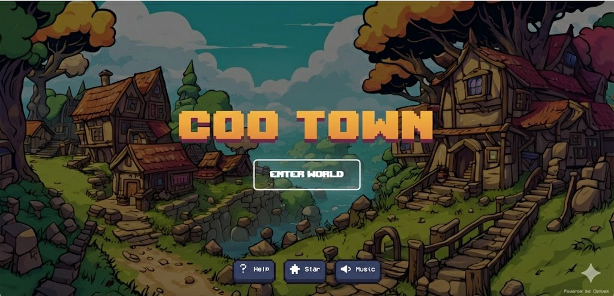

# Coo Town

> A customized fork of [Eliza Town](https://github.com/cayden970207/eliza-town), which is based on [AI Town](https://github.com/a16z-infra/ai-town) powered by [ElizaOS](https://github.com/elizaOS/eliza).



**Coo Town** is a virtual world where players can create their own unique AI Agents and watch them live, interact, and evolve autonomously in a pixel-art town.

## What's Different from Eliza Town?

| Feature | Eliza Town | Coo Town |
|---------|------------|----------|
| Manual Sprite Upload | - | Added (no API required) |
| Mobile Support | Limited | Full responsive UI |
| Image Size Validation | - | Client-side validation |
| SSRF Protection | - | URL filtering added |
| Agent List UI | Generic avatar | Actual sprite display |

## Key Features

| Feature | Description |
|---------|-------------|
| **Custom Agents** | Create AI agents with unique personalities and sprites |
| **AI Sprite Generation** | Generate pixel art sprites using Google Gemini + Replicate |
| **Manual Sprite Upload** | Upload your own 96x128px sprite sheets (no API required) |
| **Map Editor** | Built-in tile-based map editor |
| **Mobile Support** | Responsive UI with bottom sheet for mobile devices |
| **Real-time Conversations** | Watch agents chat and interact autonomously |
| **Take Over Mode** | Control any agent and chat with others |

## Tech Stack

| Component | Technology |
|-----------|------------|
| Agent Engine | [ElizaOS](https://github.com/elizaOS/eliza) |
| Game Engine & Database | [Convex](https://convex.dev/) |
| Rendering | [PixiJS](https://pixijs.com/) |
| Authentication | [Clerk](https://clerk.com/) (Optional) |
| AI Image Generation | [Google Gemini](https://ai.google.dev/) + [Replicate](https://replicate.com/) |

---

## Installation

### Prerequisites

- **Node.js 18+** (We recommend using [nvm](https://github.com/nvm-sh/nvm))
- A **[Convex](https://convex.dev/)** account (free tier available)

### Step 1: Clone & Install

```bash
git clone https://github.com/dwebxr/coo-town.git
cd coo-town
npm install
```

> **macOS Note**: If you encounter hnswlib-node compilation errors, run:
> ```bash
> export SDKROOT=$(xcrun --show-sdk-path)
> npm install
> ```

### Step 2: Configure Convex Backend

1. Initialize Convex:
   ```bash
   npx convex dev
   ```

2. Set environment variables:
   ```bash
   # Required: LLM Provider (choose one)
   npx convex env set OPENAI_API_KEY "your-openai-api-key"
   # or
   npx convex env set OLLAMA_HOST "http://localhost:11434"

   # Optional: ElizaOS Server (for advanced agent features)
   npx convex env set ELIZA_SERVER_URL "https://your-eliza-server.com"

   # Optional: AI Character Generation
   npx convex env set GOOGLE_API_KEY "your-google-api-key"
   npx convex env set REPLICATE_API_TOKEN "your-replicate-token"
   ```

### Step 3: Run the Game

```bash
npm run dev
```

Visit **http://localhost:5173** to enter Coo Town!

---

## Usage Guide

### Creating Custom Characters

1. Click **"Characters"** button in the top menu
2. Choose a method:

| Method | Requirements | Description |
|--------|--------------|-------------|
| **AI Generate** | Google API + Replicate | Describe your character, AI generates the sprite |
| **Manual Upload** | None | Upload your own 96x128px sprite sheet |

#### Sprite Sheet Format

```
96px wide x 128px tall
┌────┬────┬────┐
│ ↓1 │ ↓2 │ ↓3 │  Row 1: Walking Down
├────┼────┼────┤
│ ←1 │ ←2 │ ←3 │  Row 2: Walking Left
├────┼────┼────┤
│ →1 │ →2 │ →3 │  Row 3: Walking Right
├────┼────┼────┤
│ ↑1 │ ↑2 │ ↑3 │  Row 4: Walking Up
└────┴────┴────┘
Each frame: 32x32px
```

### Creating Agents

1. Click **"New Agent"** button
2. Select a sprite from your characters
3. Set name, personality, and behavior plan
4. Click create to spawn the agent

### Interacting with Agents

1. Click **"Take Over"** button
2. Select an agent to control
3. Click on other agents to start conversations
4. Type messages to chat

### Map Editor

Access the built-in map editor:
```
http://localhost:5173/?editor=true
```

Features:
- Terrain, paths, props, and building tiles
- Multiple layers
- Collision editing
- Export/import map data

---

## Project Structure

```
├── convex/              # Backend (Convex functions)
│   ├── agent/           # Agent behavior logic
│   ├── aiTown/          # Game world logic
│   ├── elizaAgent/      # ElizaOS integration
│   └── util/            # LLM utilities
├── src/
│   ├── components/      # React components
│   │   ├── Game.tsx           # Main game container
│   │   ├── MapEditor.tsx      # Map editor
│   │   ├── PlayerDetails.tsx  # Agent details panel
│   │   └── ...
│   ├── hooks/           # Custom React hooks
│   └── lib/             # Utilities
├── data/                # World data and maps
│   └── gentle.js        # Default map
└── public/assets/       # Static assets
    ├── characters/      # Built-in sprites
    └── tilesets/        # Map tiles
```

---

## API Keys Reference

| Key | Required | Purpose |
|-----|----------|---------|
| `OPENAI_API_KEY` | Yes* | Agent conversations (1536-dim embeddings) |
| `OLLAMA_HOST` | Yes* | Alternative to OpenAI (local LLM) |
| `GOOGLE_API_KEY` | No | AI character concept art generation |
| `REPLICATE_API_TOKEN` | No | AI sprite sheet generation |
| `ELIZA_SERVER_URL` | No | External ElizaOS server connection |

*One LLM provider is required

---

## Mobile Support

Coo Town is mobile-responsive:
- Bottom sheet UI for agent details
- Touch-friendly controls
- Responsive modals

---

## Contributing

1. Fork the repository
2. Create a feature branch: `git checkout -b feature/my-feature`
3. Make your changes
4. Submit a Pull Request

---

## Credits

- **[Eliza Town](https://github.com/cayden970207/eliza-town)** - The base fork
- **[AI Town](https://github.com/a16z-infra/ai-town)** - Original project (MIT License)
- **[ElizaOS](https://github.com/elizaOS/eliza)** - Agent framework
- **[PixiJS](https://pixijs.com/)** - Rendering engine
- **[Convex](https://convex.dev/)** - Backend platform
- Assets by [George Bailey](https://opengameart.org/content/16x16-game-assets), [Hilau](https://opengameart.org/content/16x16-rpg-tileset), and [Ansimuz](https://opengameart.org/content/tiny-rpg-forest)

---

## License

MIT License - see [LICENSE](LICENSE) for details.
